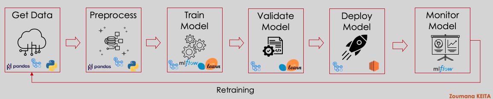
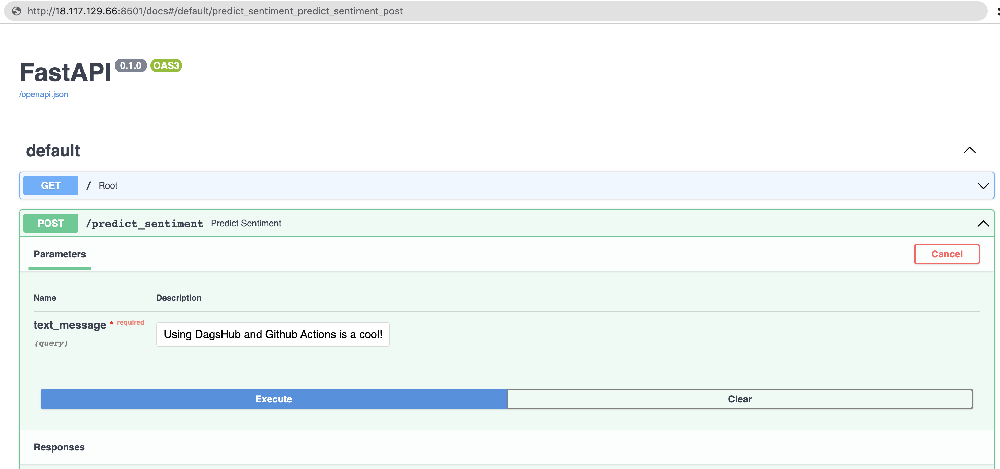
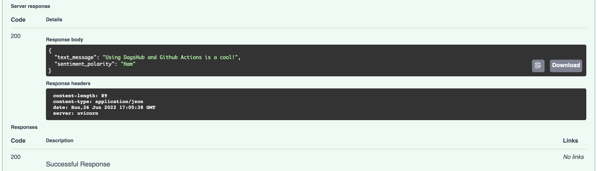

# ML Ops with GitHub Actions, DagsHub and AWS EC2 Instance 

  

This repository can be used for easily setting up a data science or machine learning project with automated training and deployment using [GitHub Actions](https://github.com/features/actions), [DagsHub](https://dagshub.com/) and [AWS EC2](https://aws.amazon.com/fr/ec2/). 
## Main Concepts Covered 
The following concepts are automatically performed using Github Actions and DagsHub.
- Automatically pull and process data from Github using [Pandas](https://pandas.pydata.org/) and [Python](https://www.python.org/). 
- Train your model and track experiment with MLFlow and [SKlearn](https://scikit-learn.org/stable/).
- Validate the model and save the serialized model and metadata to DVC on DagsHub.
- Deploy your model to AWS EC2 instance.
- Monitor the metrics with MLFlow.
- Retrain if necessary.

  

# Getting started 
### 1. Prerequisites
#### Platforms
The following prerequisites are required to make this repository work:
- AWS subscription
- Access to [DagsHub](https://dagshub.com/)
- Access to [GitHub Actions](https://github.com/features/actions)

#### Other ressources
- Python 3.9.1 
- DVC 2.11  
- You can find all the additional information in the `requirements.txt` file

#### Main Components of Github Actions
GitHub Actions contains five main components as shown below. 

  

## Results On DagsHub
DagsHub provides the capabilities to use MLFlow and DVC while giving the choice of working on Github. The following results are the experiments from DagsHub, using MLFlow to track the model `F1-Score`, `Precision` and `Recall`.

  

## Github Actions Experiment 
The following animation corresponds to the execution of the pipeline using Github Actions from Data Extraction to Model Training. 

  

## Test App deployed on EC2
This is the final result after the model is deployed into productiion.
- Input:`Using DagsHub and Github Actions is so cool`. 
- 

  

- Response: `Ham` meaning that the previous message is not a spam :) 

  

## Full Article On Medium 
Read the full article on [my medium](https://zoumanakeita.medium.com/) and Follow me for more content.
